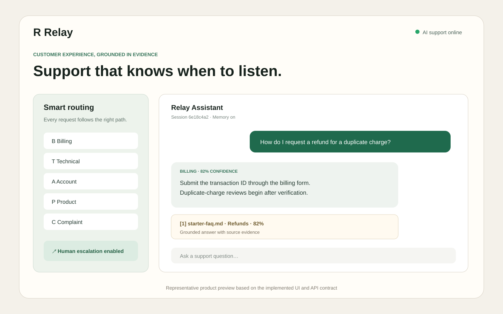
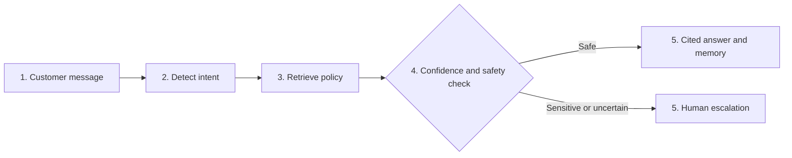
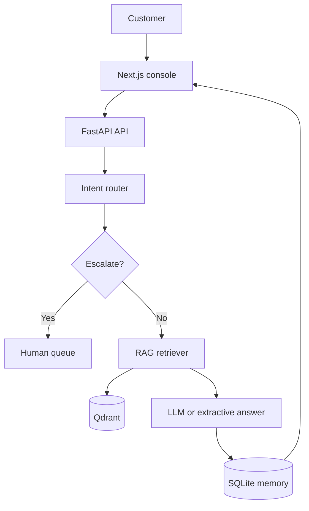

# AI Customer Support Assistant



> Representative preview generated from the implemented frontend layout and verified API response fields.

A full-stack support assistant that routes customer requests, retrieves grounded knowledge, remembers conversations, cites sources, and escalates sensitive or low-confidence cases to a human.

## Product Walkthrough



### Example: automated support path

**Customer**

> How do I request a refund for a duplicate charge?

**Representative response**

> I classified this as a **billing** request and found the refund policy. Submit the transaction ID through the billing form; duplicate-charge reviews are normally started after verification.
>
> **Citation:** starter-faq.md · Refunds and duplicate charges

### Example: escalation path

**Customer**

> My account may be compromised. I need a human now.

**Representative response**

> This request has been escalated to a human support agent because it concerns possible account compromise.

The response contract includes intent, confidence, citations, session ID, escalation status, and escalation ID. Examples show implemented behavior and are not classification-accuracy claims.

### API example

```bash
curl -X POST http://localhost:8000/api/chat \
  -H "Content-Type: application/json" \
  -d '{"message":"How do I request a refund for a duplicate charge?"}'
```

```json
{
  "session_id": "example-session-id",
  "message_id": 2,
  "answer": "Submit the transaction ID through the billing form...",
  "intent": "billing",
  "confidence": 0.82,
  "citations": [
    {
      "source": "starter-faq.md",
      "section": "Refunds and duplicate charges",
      "passage": "Duplicate charges can be submitted for review...",
      "score": 0.82
    }
  ],
  "escalated": false,
  "escalation_id": null
}
```

## The Problem

Support teams repeatedly answer the same questions while also handling urgent fraud, safety, account-access, and complaint cases. A useful assistant must do more than generate text: it must understand the request, retrieve approved information, maintain context, and know when automation should stop.

## The Solution

This application combines deterministic intent routing with semantic RAG. FastAPI classifies each request, retrieves relevant knowledge from Qdrant, generates or extracts a cited answer, persists the conversation in SQLite, and creates an escalation record when policy conditions are met. A Next.js console exposes the complete workflow.

## Tech Stack

**Python | FastAPI | Next.js | TypeScript | Sentence Transformers | Qdrant | SQLite | Groq/Gemini/Mistral | Docker | GitHub Actions**

> The current implementation uses sentence-transformer embeddings and deterministic intent rules. It does not claim a separately trained PyTorch intent-classification model.

## Architecture



## Key Features

- Route billing, technical, account, product, complaint, and general requests
- Search a Qdrant knowledge base with sentence-transformer embeddings
- Return source citations with each grounded answer
- Preserve multi-turn session history in SQLite
- Escalate explicit human requests and sensitive language
- Escalate low-confidence retrieval and repeated unresolved responses
- Upload PDF, DOCX, Markdown, and TXT knowledge sources
- Review and update human-escalation cases through the API
- Run without an LLM key using an extractive fallback
- Test and build the project through GitHub Actions CI

## Results and Measurable Evidence

| Measure | Result | Scope |
|---|---:|---|
| Labeled support messages | 10 | Versioned synthetic evaluation set |
| Intent classes | 6 | Billing, technical, account, product, complaint, general |
| Intent accuracy | 0.900 | Real deterministic router on the offline fixture |
| Escalation recall | 1.000 | Urgent and low-confidence positive cases |
| RAG faithfulness | 1.000 | Atomic claims supported by supplied evidence |
| Automated evaluation gates | 3 | Routing, escalation, faithfulness |

The system automates the complete **route → retrieve → answer → remember → escalate** decision path. It also persists conversation history and creates reviewable escalation records instead of silently answering sensitive or uncertain requests.

These results are deterministic regression measurements on a small synthetic set. They are not production ticket volume, agent-time savings, customer-satisfaction impact, or independently audited model performance.
## Screenshots / Demo

Run the local demonstration and test both automation paths:

- Support console: `http://localhost:3000`
- API documentation: `http://localhost:8000/docs`
- Qdrant dashboard: `http://localhost:6333/dashboard`

Example demo flow:

1. Ask a product or billing question and inspect the cited knowledge source.
2. Continue in the same session to verify conversation memory.
3. Ask for a human agent or submit fraud-related language to verify escalation.

## How to Run

### Prerequisites

- Docker and Docker Compose
- Optional: a Groq, Gemini, or Mistral API key

### Setup

```bash
git clone https://github.com/ParamasivaVemavarapu/AI-Customer-Support-Assistant---Intent-Routing-and-RAG.git
cd AI-Customer-Support-Assistant---Intent-Routing-and-RAG
cp backend/.env.example backend/.env
docker compose up --build
```

The backend indexes `knowledge-base/starter-faq.md` on first startup. Extractive mode works without an external LLM key.

## API

| Method | Endpoint | Purpose |
|---|---|---|
| `GET` | `/health` | Check application health |
| `POST` | `/api/chat` | Route, retrieve, answer, remember, or escalate |
| `GET` | `/api/sessions/{session_id}` | Return conversation history |
| `POST` | `/api/knowledge` | Add knowledge-base content |
| `GET` | `/api/escalations` | List escalation cases |
| `PATCH` | `/api/escalations/{case_id}` | Update escalation status |

## Escalation Policy

The assistant escalates when the customer requests a human, uses urgent safety/fraud/legal/account-compromise language, receives retrieval confidence below the configured threshold, or accumulates two unresolved responses.

## Engineering Quality

This repository includes modular Python services, typed API contracts, environment-based configuration, automated tests with coverage, Ruff linting, TypeScript checks, reproducible Docker builds, and GitHub Actions CI. See [Engineering Quality](docs/ENGINEERING.md) for the quality gates and production-readiness boundary.

## Production Roadmap

- Add screenshots and a hosted demonstration
- Train and evaluate a supervised transformer intent classifier
- Replace SQLite with PostgreSQL and add tenant isolation
- Integrate Zendesk, Salesforce, or ServiceNow
- Add PII redaction, authentication, RBAC, rate limiting, and audit logs
- Add hybrid retrieval, reranking, and offline RAG evaluation

## Reproducible Evaluation

The versioned [evaluation suite](evaluation/README.md) executes the real intent router and measures intent accuracy, escalation recall, and claim-to-evidence RAG faithfulness.

```bash
python evaluation/evaluate.py
```

The labeled fixture is synthetic and intended for deterministic regression testing. Production claims require a larger, independently labeled, de-identified traffic sample.

## License

MIT
